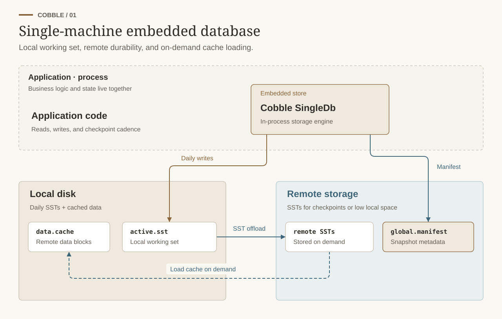
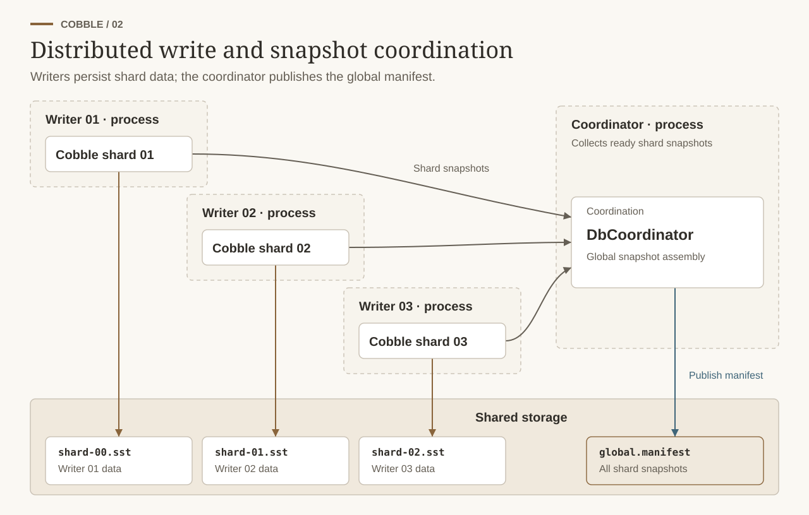
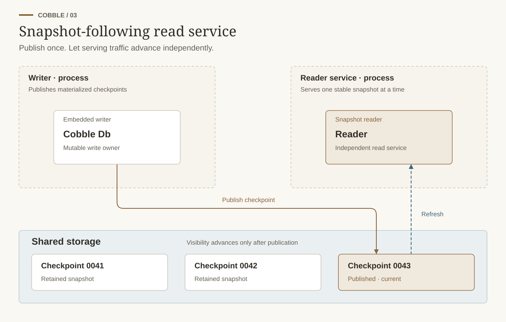
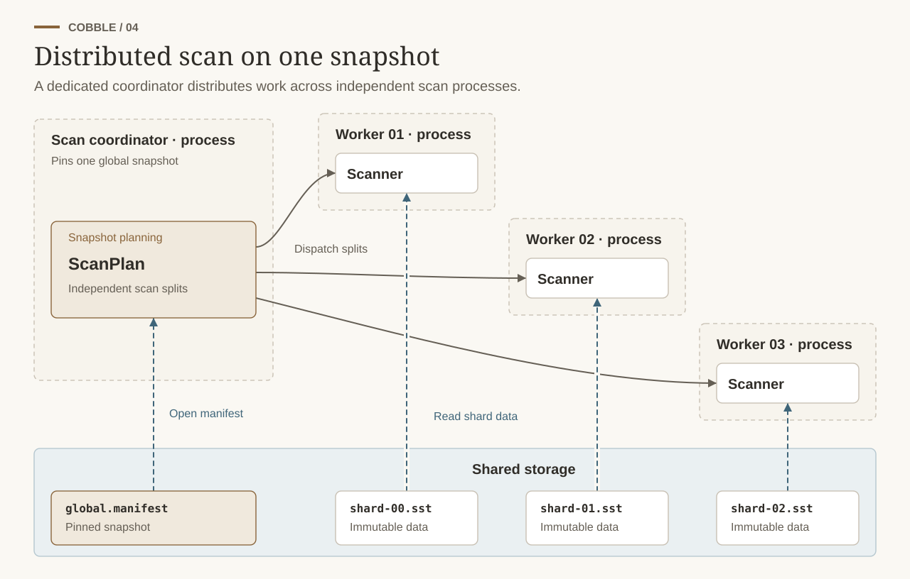
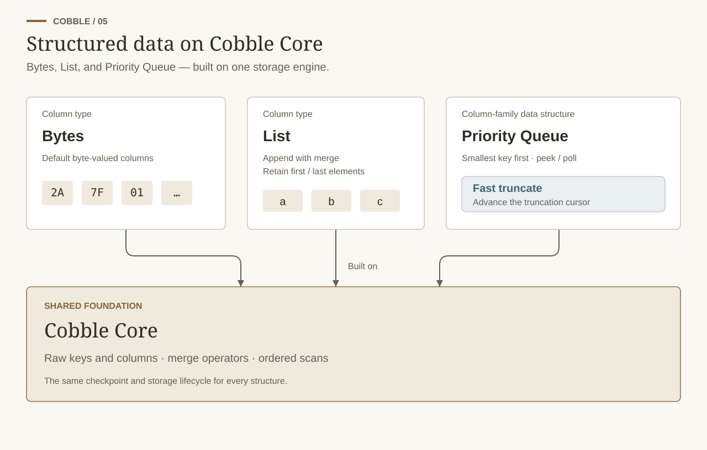

  
  
  
  
  
  

**Cobble** is a high-performance LSM-based key-value storage engine designed for both embedded and distributed systems.
It provides a flexible and efficient storage solution for various workloads, from small-scale applications to large distributed services.
Compared with other embedded key-value stores like [RocksDB](https://github.com/facebook/rocksdb), it offers multiple file formats (SSTable and Parquet), distributed storage support, distributed snapshots, online rescaling between nodes, remote compaction, and more.
Thus, it really fits the needs of modern distributed systems that require a versatile and scalable storage engine.

## Features

We list some of Cobble's key features below, they are either implemented or are planned for future releases:

- **Hybrid Storage**: Local disk and remote object storage (S3, OSS, etc.) can be used individually or together; supports multi-volume distributed I/O scheduling.
- **Schema Support & Evolution**: User-defined column schemas with incremental evolution.
- **Multiple File Formats**: SST and Parquet for both point lookup and analytical queries.
- **Distributed Snapshots**: Global consistent snapshots across multiple shards and machines, with local shard snapshots as building blocks.
- **One writer process per shard**: One process owns writes for consistency; that writer accepts concurrent read and write calls, while snapshot readers can run in other processes or machines.
- **Remote Compaction**: Compaction can run on remote object storage to reduce local resource usage.
- **Multi-version Snapshots**: Read historical data states via versioned snapshots.
- **Key-value Separation**: Separates keys and values to optimize large-value, low-access patterns.
- **Time-to-live (TTL)**: Expire and clean up data automatically.
- **Hot/Cold Separation**: Optimize storage and access efficiency with multiple strategies.
- **Merge Operators**: Support for user-defined merge operations on values. Efficiently handle updates without reading existing values.
- **Multi-language Bindings**: Now java-binding supported. Planned support for C, C++, Python and Go bindings.

For more details on features and design, see docs:
- https://cobble-project.github.io/cobble/latest/architecture/

Projects that use Cobble:
- [Cobble Flink](https://github.com/cobble-project/cobble-flink) - a [Apache Flink](https://github.com/apache/flink)'s state backend, source and sink built on Cobble.

## Use Cases

### Single-machine embedded database

Embed Cobble in the same process as the application for fast local reads and writes. Local SSTs are offloaded to remote storage for checkpoints or capacity pressure, while remote SST blocks are loaded back into the isolated local cache on demand; the global manifest remains durable remotely.

  

[Learn about single-machine deployments](https://cobble-project.github.io/cobble/latest/getting-started/single-db.html).

### Distributed write and snapshot coordination

Partition write ownership across Cobble shards when the workload needs to scale, while a coordinator assembles shard snapshots into one globally consistent view.

  

[Learn about distributed deployments](https://cobble-project.github.io/cobble/latest/getting-started/distributed.html).

### Snapshot-following read service

Run readers independently from writers when serving traffic should use a stable materialized view and advance only when a newer snapshot is ready.

  

[Learn about readers](https://cobble-project.github.io/cobble/latest/getting-started/reader-and-scan.html#reader--snapshot-following-read-service).

### Distributed scan on one snapshot

Split a pinned global snapshot into independent work units when batch or analytical processing must scan every shard from the same consistent point in time.

  

[Learn about distributed scans](https://cobble-project.github.io/cobble/latest/getting-started/reader-and-scan.html#distributed-scan).

### Structured application state

Use the structured layer for `Bytes` and `List` columns or a column-family-scoped priority queue with cursor-based fast truncation, while retaining Cobble's underlying storage behavior.

  

[Learn about structured data](https://cobble-project.github.io/cobble/latest/getting-started/structured-db.html).

## Getting Started

Follow the [Quick Start](https://cobble-project.github.io/cobble/latest/getting-started/quick-start.html) for runnable examples covering the main usage patterns, or browse the [complete documentation](https://cobble-project.github.io/cobble/latest/).

## Build and Test

See the [contributing guide](CONTRIBUTING.md) for environment setup, build commands, formatting, linting, and test workflows.

## Contributing

We welcome contributions from the community! Please refer to the [CONTRIBUTING.md](CONTRIBUTING.md) file for guidelines on how to contribute to the project.

## License

This project is licensed under the Apache-2.0 License. See the [LICENSE](LICENSE) file for details.

## Maintainers

- [Zakelly](https://github.com/zakelly) - Project Founder & Main Developer
