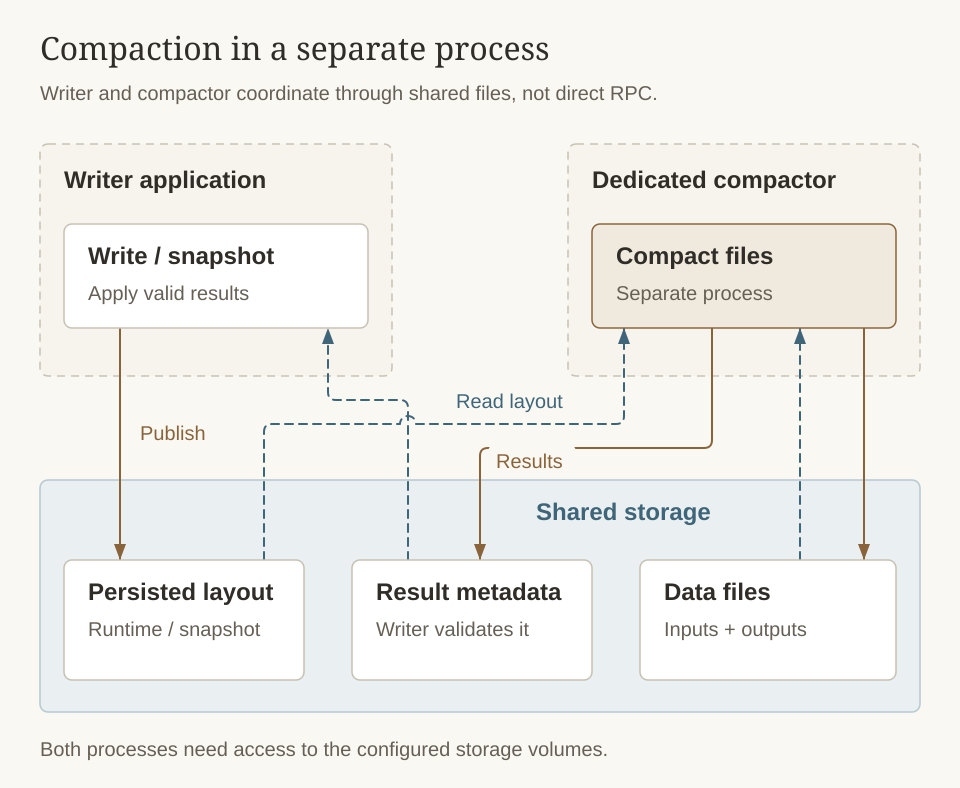

# Compaction

As data accumulates through [memtable flushes](memtable), the [LSM tree](lsm-tree) grows more files across its levels. Without maintenance, reads would slow down because every lookup might need to check many overlapping files. **Compaction** is the background process that keeps the tree healthy — merging files, removing stale data, and maintaining the sorted structure that makes reads efficient.

## Why Compaction Matters

Compaction serves several purposes simultaneously:

- **Keeps reads fast.** By merging overlapping files in L0 into non-overlapping sorted files in deeper levels, compaction reduces the number of files a read must check.
- **Reclaims space.** Deleted keys leave tombstone markers and updated keys leave old versions. Compaction removes these stale entries, reclaiming disk space.
- **Resolves [merge operations](merge-operator).** When multiple merge operands exist for the same key across different files, compaction combines them into a single resolved value.
- **Applies [TTL expiration](../getting-started/configuration#ttl).** Expired entries are dropped during compaction, so they no longer consume storage or slow down reads.
- **Materializes [schema evolution](schema-evolution).** If columns have been added or removed, compaction rewrites old data in the current schema format, so future reads no longer need on-the-fly transformation.

## Compaction Policies

Cobble provides two policies for deciding *which* files to compact, each suited to different workloads:

### RoundRobin (default)

This policy cycles through levels in order, giving each level a fair share of compaction effort. It produces predictable, steady-state I/O patterns and works well for most general-purpose workloads. If you are unsure which policy to choose, start here.

### MinOverlap

This policy selects files that overlap the least with the target level, minimizing the amount of data rewritten in each compaction. It can reduce overall write amplification for write-heavy workloads, at the cost of occasionally producing larger compaction bursts when heavily overlapping regions finally need attention.

Choose `MinOverlap` if write throughput is your primary concern and you can tolerate occasional I/O spikes.

## Remote Compaction

In distributed deployments, compaction can consume significant CPU and I/O on writer nodes. Cobble supports **offloading compaction to dedicated worker nodes** via [remote compaction](../getting-started/remote-compaction).

When remote compaction is enabled, the writer serializes the compaction task and sends it to a remote server. The server reads the input files from shared storage, performs the merge, writes output files, and returns the result metadata. The writer then applies the version edit to update its LSM tree. This keeps writer nodes focused on ingestion while background maintenance runs elsewhere.

Every writable DB publishes a plain TOML `PROPERTIES` file at the root of its metadata directory.
The writer checks it on every startup and atomically refreshes it when the sanitized configuration
has changed.
It records the writer's configuration and authoritative volume layout. Volume credentials are
removed, including credentials carried through the descriptor fields, URL, or common backend
options. The remote compactor reads this file per DB when choosing an output volume and restores
credentials only from its own process configuration.

## Dedicated Compaction

Dedicated compaction moves compaction work out of the writer process. Configure the writer with
`compaction_mode: dedicated`, then start the compactor:

```bash
cobble-cli compact \
  --config ./config.yaml \
  --workers 4 \
  s3://state-bucket1/cobble \
  s3://state-bucket2/cobble
```

Each path may point to one Cobble DB or a parent directory containing multiple DBs. `--workers`
controls how many DBs can be compacted concurrently. Only DBs configured for dedicated compaction
are processed.

The writer and compactor must be able to access all configured storage volumes. Put storage
credentials in the compactor configuration rather than in command-line paths. When TTL is enabled,
keep their host clocks synchronized.

The default `runtime_manifest_mode: auto` is recommended. Set it to `disabled` only when the
compactor must use snapshot manifests instead.



Unlike the remote-server mode above, dedicated compaction coordinates through shared storage rather than a direct writer-to-server request. The writer still validates and applies results; runtime manifests describe persisted layout and do not replace recovery snapshots.

## Tuning Compaction Behavior

Several configuration parameters let you control how aggressively compaction runs and how it shapes the LSM tree:

| Parameter | What it controls |
|-----------|-----------------|
| `l0_file_limit` | How many L0 files accumulate before compaction starts. Lower values mean more frequent but smaller compactions. |
| `l1_base_bytes` | Target size for level 1. This anchors the entire level hierarchy. |
| `level_size_multiplier` | How much larger each level is than the previous one (default: 10×). Higher values mean fewer levels but more data per compaction. |
| `base_file_size` | Target output file size. Larger files mean fewer files to manage but coarser-grained compaction. |
| `compaction_policy` | `RoundRobin` for steady-state or `MinOverlap` for write-optimized workloads. |
| `compaction_mode` | `Embedded` runs compaction in the writer; `Dedicated` uses `cobble-cli compact`. |
| `runtime_manifest_mode` | Controls persisted-layout publication for dedicated compaction. |

## Write Amplification and Space Amplification

Understanding these two trade-offs helps you tune compaction for your workload:

**Write amplification** is the ratio of bytes written to disk versus bytes written by the application. Every piece of data is written at least once (L0 flush) and may be rewritten as it moves through deeper levels. A `level_size_multiplier` of 10 typically produces a write amplification around 10–30× depending on the workload.

**Space amplification** comes from multiple versions of the same key existing across levels. Compaction reduces this, but if snapshots are retained (via `snapshot_retention`), older versions are kept alive for those snapshots. Aggressive compaction with low snapshot retention minimizes space overhead.

For write-heavy workloads, increase `l0_file_limit` and `level_size_multiplier` to reduce compaction frequency. For read-heavy workloads, keep defaults or lower them to ensure the tree stays compact and reads stay fast.

## Compaction and Value Separation

If you are using [key-value separation](key-value-separation), compaction only operates on the LSM tree files (which contain keys and value pointers). The large values in the VLOG are not rewritten during compaction. This means that compaction is much faster when value separation is enabled, since it only needs to merge small metadata files rather than large data files.
It trades off some read performance (since value pointers may need to be dereferenced) for much lower write amplification and faster compactions.
