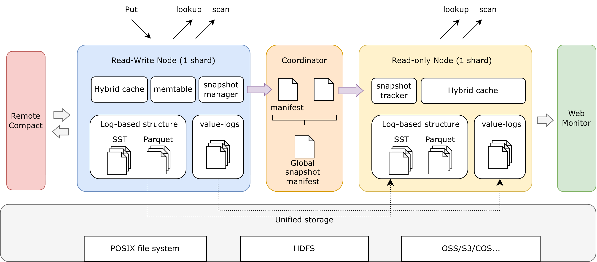

# Architecture

This section explains the design principles behind Cobble and how its components work together. The goal is to help you understand *why* Cobble behaves the way it does, so you can make informed decisions about configuration and deployment.

The whole architecture is described in above diagram. Data is split in buckets and each shard may contain multiple buckets. Each shard is managed by a `Db` instance (the read-write node in the diagram), which handles writes, compactions, and local snapshots. The `Coordinator` manages global snapshots across shards. The `ReadonlyDb` instances (the read-only node in diagram) can read from the materialized snapshots for consistent reads and scans. All those components can be embedded in any service or application, providing a lot of flexibility in how you build on top of Cobble. These components share loose consistency through shared file-based snapshots and manifest files, leaving the application to decide how to handle cross-shard consistency if needed.

## Design Philosophy

Cobble is built around a few core ideas:

- **Focus on embedded key-value storage.** Cobble is designed to be a high-performance embedded database that can be used as a building block for larger systems. It provides the primitives for key-value storage, snapshots, and distributed coordination, but leaves higher-level features (like SQL layers or distributed transactions) to be built on top.
- **Weak coordination among shards.** In a distributed deployment, each `Db` shard operates mostly independently, with the Coordinator only involved in snapshot management. This minimizes cross-shard communication and allows for high write throughput without distributed locking. We leave it to the application to decide how to partition data and handle cross-shard consistency if needed.
- **Flexible with more options.** Cobble provides multiple implementations for key components (memtable, file formats, compaction strategies) that can be configured based on workload needs. The architecture is designed to accommodate these options without sacrificing core performance.
- **Snapshots for consistency as well as read serving.** The snapshot system is not just for backup and restore — it's a fundamental part of how Cobble provides consistent read views in a distributed environment. This makes Cobble a good fit for analytical workloads that need to read from a consistent point-in-time view while writes are ongoing.
- **Single-threaded APIs for simplicity and performance.** Each components' APIs are designed to be called from a single thread, which simplifies the internal design and allows for high performance without locking. For concurrent access, you use multiple instance of `Reader` or `Scanner` against snapshots, which are safe to use concurrently.

## Module Map

| Module | What it provides |
|--------|-----------------|
| [LSM Tree](lsm-tree) | The core storage structure — how data is organized on disk |
| [Memtable](memtable) | In-memory write buffers — why there are three implementations |
| [Compaction](compaction) | Background merging — how Cobble keeps reads fast over time |
| [Key-Value Separation](key-value-separation) | VLOG — when and why to store values separately |
| [Read & Write Paths](read-write-path) | How data flows from writes to reads |
| [Snapshot System](snapshot) | Point-in-time consistency for restore, reads, and scans |
| [File Management](file-management) | File lifecycle, volume selection, and storage backends |
| [Block Cache](block-cache) | Multi-tier caching for read performance |
| [Schema Evolution](schema-evolution) | Adding and removing columns without rewriting data |
| [Merge Operators](merge-operator) | Efficient read-modify-write without extra round trips |
| [Online Rescale](rescale) | Runtime shard rebalance using shrink-then-expand bucket migration |
