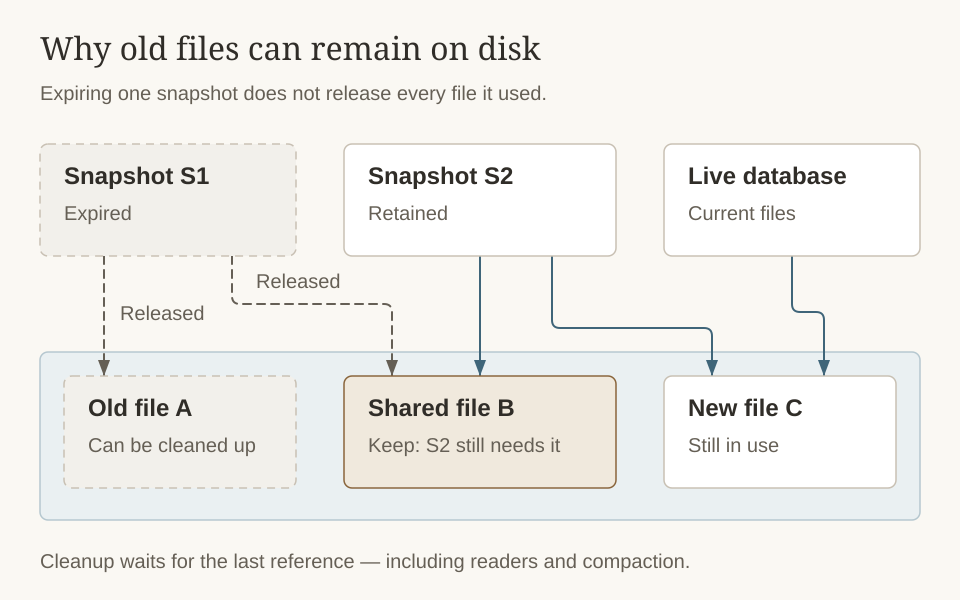

# Snapshot System

Snapshots are Cobble's mechanism for capturing a consistent, point-in-time view of the database. They serve multiple purposes: restoring a database after a crash or restart, providing a stable read view for serving queries, and enabling [distributed scans](../getting-started/reader-and-scan#distributed-scan) across shards.

## What a Snapshot Captures

A snapshot records the complete state needed to reconstruct the database at a particular moment:

- Which data files (SST/Parquet) make up each [LSM tree](lsm-tree) level.
- Which [VLOG files](key-value-separation) are referenced.
- The current [schema](schema-evolution) version and column configuration.
- Optionally, the contents of the active [memtable](memtable) (for incremental snapshots).
- A timestamp from the database's time provider.

If the primary and snapshot volumes are the same, a snapshot does **not** copy the underlying data files. It records references to them, and Cobble's [file management](file-management) layer ensures that referenced files are not deleted until the snapshot is no longer needed.

## Shard Snapshots vs Global Snapshots

In a [distributed deployment](../getting-started/distributed), each `Db` instance (shard) independently takes a **shard snapshot**. The `DbCoordinator` then assembles these shard snapshots into a **global snapshot** — a manifest that references all shards and their bucket ranges.

The global snapshot includes a **watermark timestamp** — the minimum timestamp across all participating shard snapshots. This provides a lower bound on consistency: all data up to the watermark is guaranteed to be included.

For [single-machine use](../getting-started/single-db) via `SingleDb`, this two-tier process is handled automatically. Calling `snapshot()` on a `SingleDb` takes a shard snapshot and wraps it into a global snapshot in one step.

## Snapshot with Callback

`snapshot_with_callback` is useful when you need to trigger downstream processing (such as notifying a read service or recording the snapshot ID) only after the manifest is safely persisted. The callback fires after the manifest file has been written, and receives the manifest object so you can inspect it or extract its ID.

## Restoring from Snapshots

Restore is the process of opening a database from a previously taken snapshot. The key requirement is that **all files referenced by the snapshot must still be accessible** from the configured [volumes](multi-volume). This includes data files, VLOG files, manifests, and schema files.

When the optional [write-ahead log](wal) is enabled, recovery can either restore the snapshot
exactly or replay the durable WAL tail after the latest snapshot.

For distributed deployments, the restore order matters: restore the coordinator first to load the global manifest, then restore each shard using its referenced shard snapshot.

By default, resume also performs a shallow, best-effort scan of each built-in POSIX primary data
directory. If a first-level file has the same UUID filename and size as a file referenced by the
selected snapshot, Cobble registers that file as an existing primary replica instead of copying it
again. Matching replicas across primary tiers are all adopted only after snapshot-chain, memtable,
and WAL recovery succeeds. A missing or mismatched file simply uses the normal restore copy path.
Set `resume_primary_residual_scan_enabled` to `false` to disable this optimization.

## Snapshot Retention

By default, Cobble keeps all snapshots. In long-running systems, old snapshots accumulate and prevent [compaction](compaction) from reclaiming space (since old file versions are still referenced). The `snapshot_retention` parameter limits how many snapshots are kept — older ones are automatically expired and their exclusively-referenced files become eligible for cleanup.

Retention removes references, not every file named by the expired snapshot. Space is reclaimed only after no retained snapshot, active reader, current database view, or in-progress compaction still needs the file.

## Memtable Snapshotting

When a snapshot is taken, Cobble flushes the active memtable to an L0 file to ensure all recent writes are captured. This guarantees that the snapshot reflects a consistent state of the database, including any in-memory data.
However, this can be inefficient for workloads with small, frequent updates, as it creates many small L0 files that may never be compacted.
To address this, Cobble offers an **incremental snapshot** option (`active_memtable_incremental_snapshot_ratio`) that includes the active memtable's contents directly in the snapshot if it's below a certain fill ratio. This avoids unnecessary flushes while still capturing recent writes in the snapshot.

On restore, the serialized memtable data is replayed into the new active memtable, seamlessly continuing from where the snapshot left off.

## Active Snapshot Switch

`Db::switch_to_snapshot(snapshot_id)` switches a running database handle to an existing shard
snapshot. It uses the normal restore path to rebuild the database runtime, including file tracking,
schema state, WAL state, background workers, and governance registration. The operation must not
run concurrently with `get` or `put` calls on the same handle.

The target is validated before the current runtime is closed. A validation failure leaves the
existing handle usable. Once close has started, a later restore failure leaves the old handle
closed and the caller must recover it explicitly.

The switch changes only the current runtime. It does not create a snapshot or persist the selected
snapshot as the database's new default:

- If snapshots `S1`, `S2`, and `S3` exist, switching to `S1` does not delete `S2` or `S3`.
- Restarting with ordinary `Db::resume` still selects the greatest available snapshot, `S3`.
- Restarting at `S1` again requires `Db::resume_from_snapshot(..., S1, ...)`.
- The next successfully published snapshot receives an ID greater than every existing snapshot;
  in this example it is `S4`, not a replacement for `S2` or `S3`.
- Newer snapshots remain under the normal expiration and retention policy. Retention is applied
  only after the new snapshot has been published successfully.

The switch also does not truncate or fork the existing WAL. This keeps the `S3` recovery path
available if the caller abandons the switch, but writes made after switching to `S1` do not form an
independently recoverable `S1` WAL branch. Applications must account for this limitation before
allowing writes between a historical switch and the next snapshot.

Snapshot metadata changes for the same database, including active switch, snapshot publication,
and pruning from another process, must be externally serialized. This version does not provide
distributed fencing for concurrent cross-process snapshot writers.
