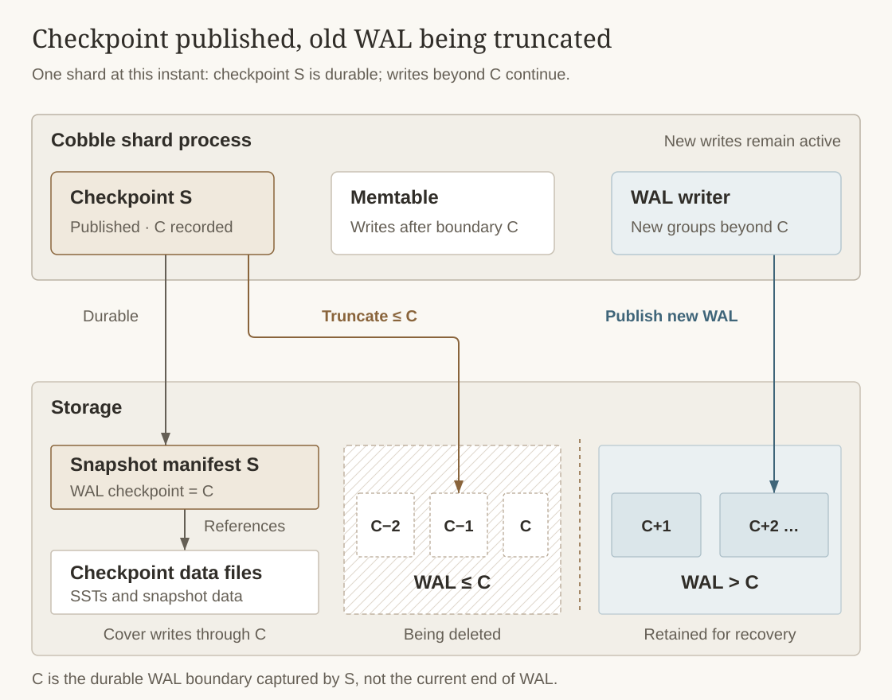
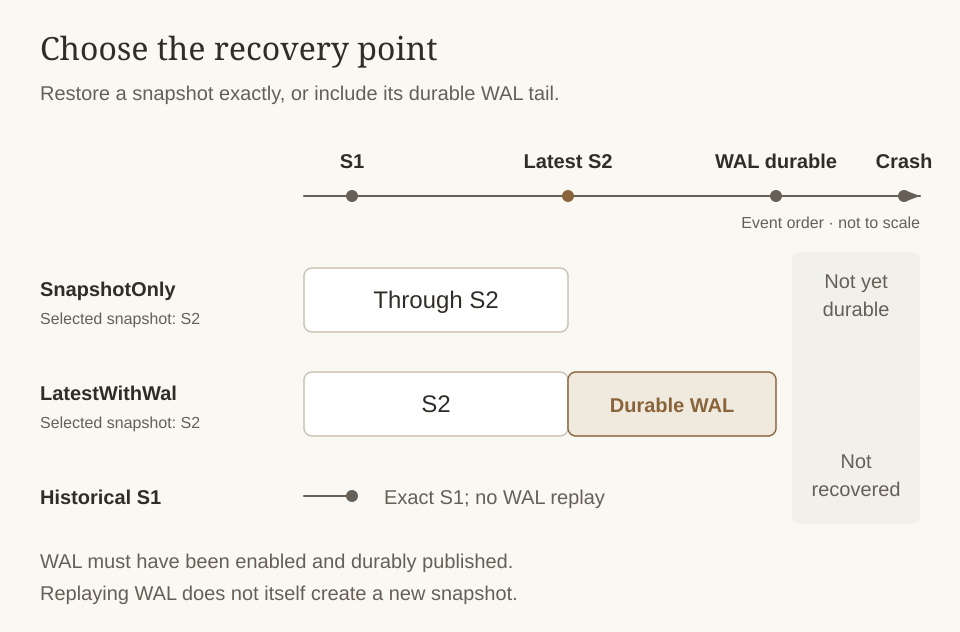

# Write-Ahead Log

Cobble's write-ahead log (WAL) is an optional crash-recovery log. When enabled, each mutation is
recorded before it is applied to the memtable. WAL records are published in groups so concurrent
writes can share storage I/O; writes wait for durable publication by default.

WAL is disabled by default. Enabling it requires exactly one volume with the `Wal` usage kind:

```rust
config.wal_enabled = true;
config.volumes.push(VolumeDescriptor::new(
    "s3://shared-storage/cobble-wal",
    vec![VolumeUsageKind::Wal],
));
```

The `wal_flush_interval_ms` setting controls the maximum group-publication interval and defaults to
5 milliseconds.

## Writes, Checkpoints, and WAL Truncation



The figure shows the system at checkpoint completion, not a sequence of steps. The published
checkpoint covers writes through C, so its older WAL files can be removed while the newer tail
remains available for recovery. The checkpoint and WAL areas are logical storage roles, not
necessarily separate physical devices.

A write first appends its record to an in-memory WAL buffer, then updates the memtable.
By default, it returns only after its WAL group is durably published. Opting out with
`await_durable = false` allows an earlier return; it does not make unpublished records durable.

A checkpoint briefly blocks new WAL appends, drains pending WAL groups, and captures the
database state with boundary **C**, the last durably published WAL segment ID. Writes can
continue beyond C after capture while the snapshot is materialized.

Only successful **per-shard snapshot publication** triggers deletion of WAL segments with
IDs **≤ C**. The manifest records C; newer segments remain available for recovery. Merely
requesting a checkpoint, or a failed or cancelled publication, does not authorize truncation.
If WAL deletion fails after publication, the snapshot remains valid and leftover segments can
be cleaned by a later successful checkpoint.

## Recovery Modes

Recovery always starts from a snapshot. The selected `RecoveryMode` controls whether Cobble stops
at that snapshot or also replays its durable WAL tail:

| Mode | Behavior |
|------|----------|
| `SnapshotOnly` | Restore exactly the selected snapshot. |
| `LatestWithWal` | If the selected snapshot is the latest one, replay durable WAL records written after it. Historical snapshots are restored exactly. |



The illustrated WAL tail assumes WAL was enabled for those writes. Selecting a historical snapshot never replays forward to the latest state, even with `LatestWithWal`.

```rust
let db = Db::open_from_snapshot_with_recovery_mode(
    config,
    snapshot_id,
    db_id,
    RecoveryMode::LatestWithWal,
)?;
```

`Db::resume` defaults to `LatestWithWal`, while `Db::resume_from_snapshot`,
`Db::open_from_snapshot`, and `SingleDb::resume` default to `SnapshotOnly`. Their
`*_with_recovery_mode` variants let the caller choose explicitly. This choice is independent of
whether WAL is enabled for new writes in the current configuration.

The snapshot manifest records the WAL checkpoint and storage route used for replay. Recovery uses
that recorded route even if the current configuration selects a different WAL volume for new
writes. Storage credentials are not persisted and must still be supplied by the runtime.

WAL replay does not create a snapshot. The next normal snapshot includes the recovered writes and,
after successful publication, removes WAL segments that are no longer needed.

## Limitation: Active Snapshot Switch

A historical active switch does not truncate or fork WAL. This keeps the latest snapshot and its
WAL tail recoverable, but writes made after the switch do not form an independently recoverable
branch based on the historical snapshot. See
[Active Snapshot Switch](snapshot#active-snapshot-switch) for the complete lifecycle and recovery
semantics.
