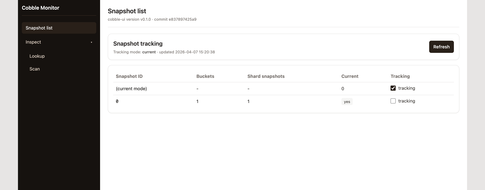
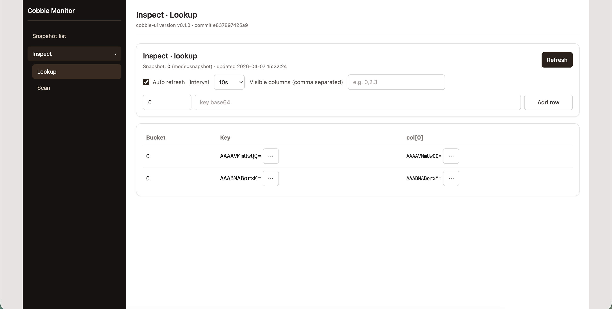
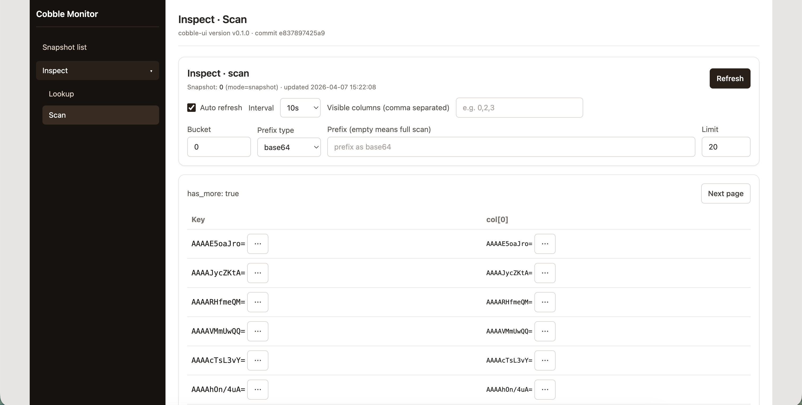

# Web Monitor

The web monitor is a read-only inspection service built on top of `Reader`. It provides:

- a browser UI for snapshots and key inspection,
- and lists all snapshots and current pointer, with the ability to switch between tracking the current snapshot or a fixed snapshot ID.

## Start via CLI

```bash
cobble-cli web-monitor --config ./config.yaml --bind 127.0.0.1:8080
```

Then open `http://127.0.0.1:8080/`.

## Embed in Rust

```rust
use cobble_web_monitor::{MonitorConfig, MonitorConfigSource, MonitorServer};

let mut server = MonitorServer::new(MonitorConfig {
    source: MonitorConfigSource::ConfigPath("./config.yaml".to_string()),
    bind_addr: "127.0.0.1:8080".to_string(),
    global_snapshot_id: None, // None = follow current global snapshot
    ..MonitorConfig::default()
})?;

let handle = server.serve()?;
println!("monitor at {}", handle.base_url());
```

## UI showcase

### Snapshot list and pointer tracking

You can choose to track the current global snapshot (default) or a fixed snapshot ID. The list shows all snapshots with their IDs and metadata.



### Lookup

You can perform key lookups against the tracked snapshot.



### Scan

You can perform range scans with optional prefix filtering.




## UI Build Notes

`cobble-web-monitor` embeds frontend assets during build. For backend-only builds:

```bash
COBBLE_WEB_MONITOR_SKIP_UI_BUILD=1 cargo build -p cobble-web-monitor
```

In this mode APIs still work; UI serves a fallback page.
